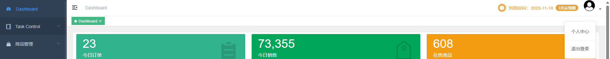

# 界面总览

## 整体布局

系统采用经典的后台管理界面布局，主要分为顶部导航栏、侧边菜单栏、主工作区和浮动聊天窗口四个部分。

### 界面结构说明
- **顶部导航栏**：系统Logo、用户信息、通知中心
- **侧边菜单栏**：功能模块导航菜单
- **主工作区**：当前功能页面内容展示
- **浮动聊天**：右下角聊天窗口

## 顶部导航栏

### 功能说明
顶部导航栏包含以下元素：
- **系统Logo**：点击可返回Dashboard首页
- **面包屑导航**：显示当前页面位置
- **搜索框**：全局搜索功能
- **通知中心**：系统消息和提醒
- **用户头像**：用户信息和设置入口

### 用户菜单
点击右上角用户头像，可展开用户菜单：
- **个人设置**：修改个人信息和密码
- **系统设置**：系统偏好设置
- **帮助中心**：使用帮助和文档
- **退出登录**：安全退出系统

## 侧边菜单

### 菜单结构
侧边菜单按功能模块组织，主要包含：

**核心功能模块：**
- 📋 任务控制
- 📦 商品管理  
- 📥 采集下架
- 📄 订单管理
- 🚚 自动发货

**管理功能模块：**
- 👥 账号管理（需权限）
- 📊 数据分析（需权限）
- ⚙️ 系统管理（需权限）

### 菜单折叠
- **折叠菜单**：点击左上角折叠按钮可收起/展开菜单
- **菜单图标**：折叠后只显示图标，鼠标悬停显示完整菜单
- **快捷键**：按 `Ctrl + B` 可快速切换菜单状态

## 工作区

### 主要内容区域
工作区是系统的核心区域，用于展示：
- **功能页面**：当前选中的功能模块内容
- **数据表格**：列表数据展示
- **操作表单**：数据录入和编辑
- **图表分析**：数据可视化展示

### 面包屑导航
面包屑导航显示当前页面在系统中的位置：
- **格式**：首页 > 一级菜单 > 二级菜单 > 当前页面
- **功能**：点击任意层级可快速跳转
- **示例**：首页 > 商品管理 > 在售商品 > 商品详情

## 标签页管理

### 多标签页功能
系统支持多标签页浏览：
- **标签页切换**：点击不同标签页快速切换功能
- **标签页关闭**：点击标签页右侧"×"关闭当前页面
- **标签页刷新**：右键标签页选择"刷新"

### 标签页操作
- **新建标签页**：点击菜单项自动在新标签页打开
- **关闭标签页**：右键选择"关闭"或点击"×"
- **关闭其他**：右键选择"关闭其他标签页"
- **关闭全部**：右键选择"关闭全部标签页"

## 聊天窗口

### 浮动聊天
系统右下角提供浮动聊天功能：
- **聊天图标**：点击聊天图标打开聊天窗口
- **消息通知**：新消息时图标会闪烁提醒
- **在线状态**：显示当前在线用户
- **消息历史**：查看历史聊天记录

### 聊天功能
- **发送消息**：在输入框输入消息后按回车发送
- **表情符号**：点击表情按钮选择表情
- **文件传输**：支持发送图片和文件
- **消息搜索**：在聊天记录中搜索历史消息

---

*相关文档：*
- [快速入门指南](quick-start.md)
- [聊天功能](../10-advanced/chat-function.md)
