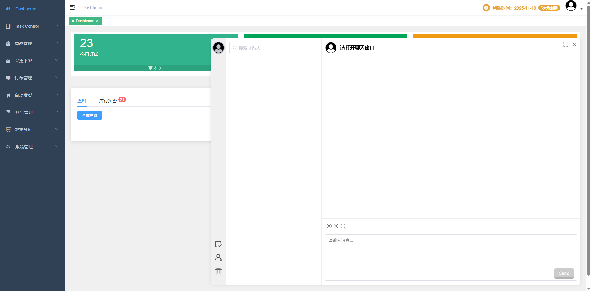
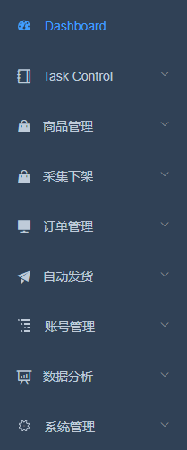
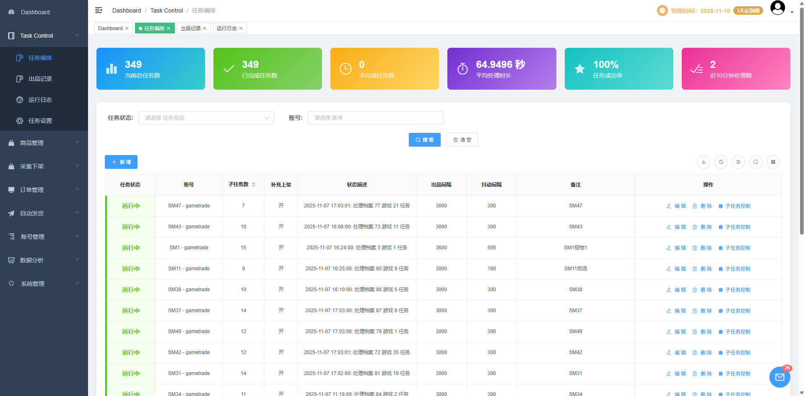
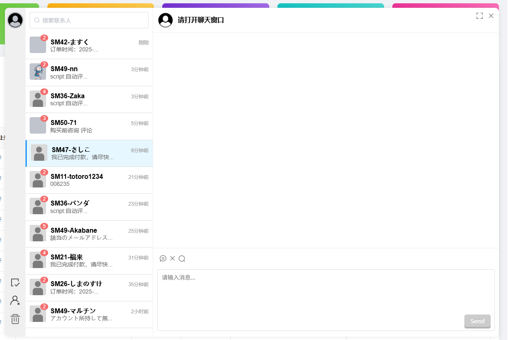

# 界面总览

系统采用经典的后台管理界面布局，主要分为顶部导航栏、侧边菜单栏、主工作区和浮动聊天窗口四个部分。

### 界面结构说明
- **顶部导航栏**：系统Logo、用户信息、通知中心
- **侧边菜单栏**：功能模块导航菜单
- **主工作区**：当前功能页面内容展示
- **浮动聊天**：右下角聊天窗口

### 侧边菜单
侧边菜单按功能模块组织，主要包含：

**核心功能模块：**
- 任务控制
- 商品管理  
- 采集下架
- 订单管理
- 自动发货

**管理功能模块：**
- 账号管理（需权限）
- 数据分析（需权限）
- 系统管理（需权限）

### 工作区
工作区是系统的核心区域，用于展示：
- **功能页面**：当前选中的功能模块内容
- **数据表格**：列表数据展示
- **操作表单**：数据录入和编辑
- **图表分析**：数据可视化展示

### 聊天窗口
系统右下角提供浮动聊天功能：
- **聊天图标**：点击聊天图标打开聊天窗口
- **消息通知**：新消息时图标会闪烁提醒
- **在线状态**：显示当前在线用户
- **消息历史**：查看历史聊天记录

- **发送消息**：在输入框输入消息后按回车发送
- **表情符号**：点击表情按钮选择表情
- **文件传输**：支持发送图片和文件
- **消息搜索**：在聊天记录中搜索历史消息