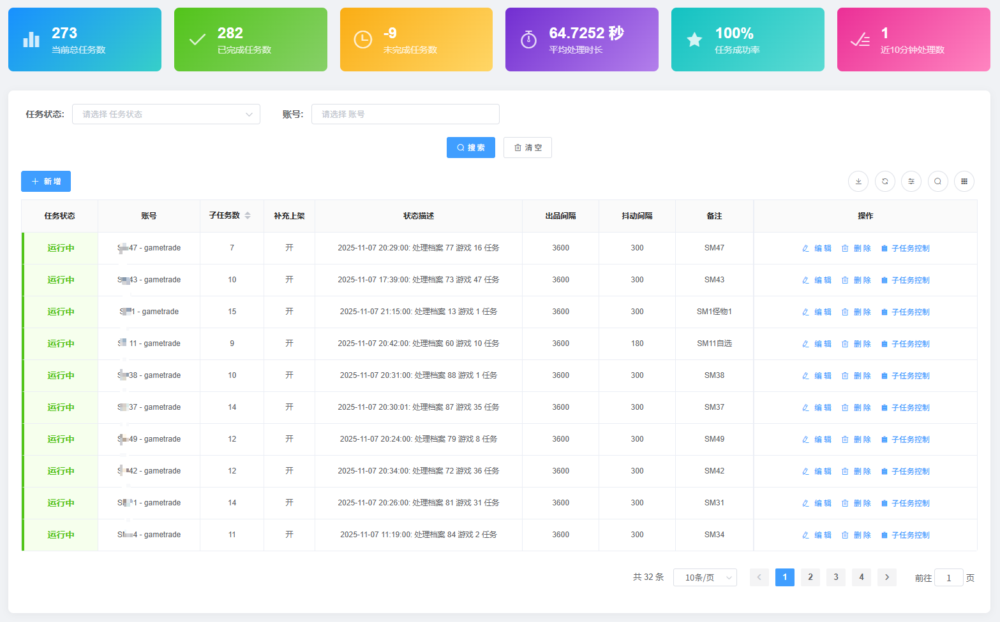
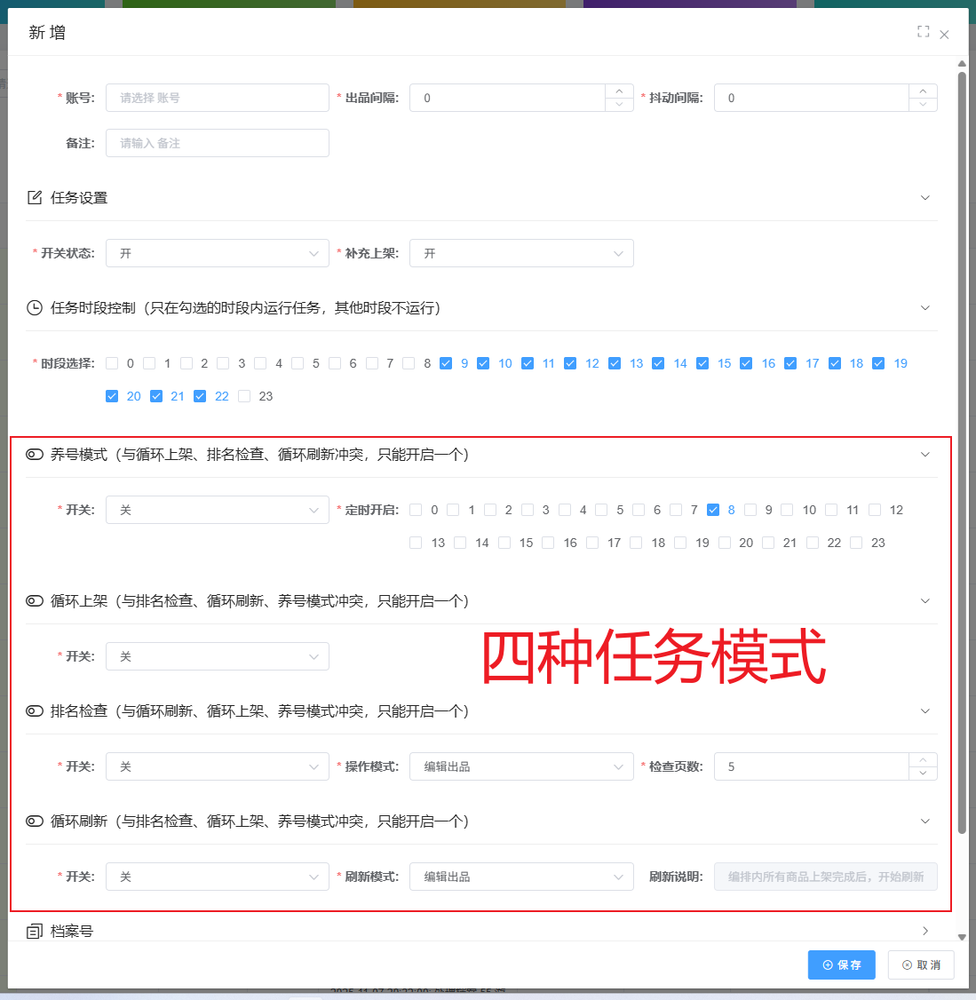
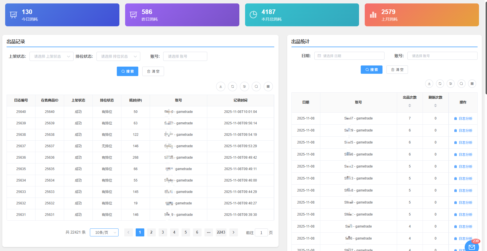
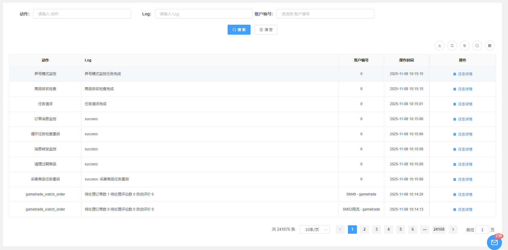
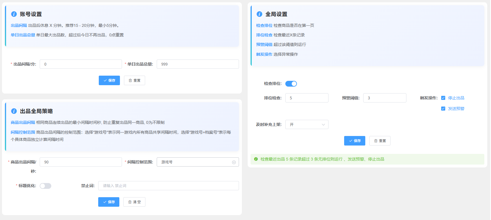

# 任务控制总览

## 功能简介

任务控制模块是系统的核心自动化引擎，负责管理各种自动化任务的创建、执行、监控和调度。通过任务编排，您可以设置复杂的业务流程自动化，减少人工操作错误，提升运营效率。

通过任务控制模块，您可以：

- 为指定账号配置商品出品任务和相关规则
- 选择不同的出品模式以适应不同业务场景
- 实时监控任务执行状态和结果
- 查看详细的执行日志和统计数据
- 配置全局设置以统一管理所有账号

## 主要功能

### 任务编排

任务编排功能用于为指定的账号设置出品的商品及相关规则，支持灵活的任务配置和多种出品模式。

#### 基本设置

- **出品间隔**：账号的固定出品间隔（单位：秒）
  - 设置账号每次出品之间的固定等待时间

- **抖动间隔**：账号的随机间隔（单位：秒）
  - 在固定间隔基础上增加随机延迟，避免固定频率被识别
  - 系统将在固定间隔基础上随机增加 0 到抖动间隔的时间

- **开关状态**：控制任务是否启用
  - 关闭后，该任务将暂停执行

- **补充上架**：是否对任务内的所有商品进行补充上架
  - 开启后，当任务内商品售出后会自动补充上架
  - 优先级低于商品档案中的补充上架设置

- **档案号、游戏号**：勾选需要出品的商品档案号
  - 从已创建的商品档案中选择需要出品的商品
  - 支持多选，可同时为多个商品配置出品任务

#### 出品模式

系统提供四种出品模式，适用于不同的业务场景：

- **养号模式**：针对被限流的账号
  - 每日仅出品一个商品，检测账号是否恢复
  - 如果账号未恢复，则次日继续执行相同步骤
  - 适用于账号被平台限流后的恢复检测

- **循环上架**：循环执行所有任务
  - 待所有任务都执行完成后，从头开始新一轮循环
  - ⚠️ **注意**：经过 2025 年 8 月 GT 规则修改后，已不推荐使用该模式
  - 如需使用，必须配合商品管理-超期设置对旧商品进行自动下架

- **排名检查**：当前主要使用的模式
  - 依次将所有任务完成后，后台开始检测该商品排名
  - 如果商品掉出了指定页数（检查页数：可设置 1-5 页），则根据操作模式进行处理
  - 每15分钟/次监控商品排名，确保商品曝光度

- **循环刷新**：循环执行任务列表
  - 依次将所有任务完成后，从第一个任务开始执行重复操作
  - 适用于需要持续刷新商品列表的场景

#### 操作模式

当排名检查模式检测到商品掉出指定页数时，系统将根据设置的操作模式进行处理：

- **编辑出品**：编辑旧商品后重新出品
  - 在商品描述中随机添加一个字符
  - 重新出品该商品，保持商品连续性

- **先下新上**：下架旧商品后上新商品
  - 先将旧商品下架
  - 等待一分钟后出品新商品
  - 确保商品列表的新鲜度

- **继续上架**：不处理旧商品，直接上新
  - 不处理旧商品，直接出品一个新商品
  - 适用于需要快速增加商品数量的场景

#### 子任务控制

任务编排中的子任务支持单独控制：

- 添加任务完成后，点击"子任务控制"按钮
- 在弹出框中对子任务进行单独的开关操作
- 可以灵活控制每个子任务的执行状态

### 出品记录

出品记录模块用于查看和管理所有任务的执行历史，提供全面的任务执行数据。

- **打码用量查看**：查看系统打码服务的使用情况
  - 统计打码次数和费用
  - 帮助您了解系统资源消耗

- **执行记录**：查看所有任务的执行历史
  - 记录每次任务的执行时间、状态、结果
  - 支持按时间、账号、商品等条件筛选

- **状态跟踪**：实时监控任务执行状态
  - 显示任务的当前执行状态
  - 支持实时刷新查看最新状态

- **结果统计**：统计任务执行成功率和耗时
  - 提供任务执行的成功率统计
  - 分析任务执行的平均耗时
  - 帮助您优化任务配置

- **异常处理**：记录和处理任务执行异常
  - 自动记录执行过程中的异常信息
  - 提供异常详情和错误原因
  - 支持异常任务的重新执行

### 运行日志

运行日志模块提供详细的任务执行日志，帮助您深入了解系统运行情况。

- **详细日志**：记录任务执行的详细过程
  - 记录每个步骤的执行情况
  - 包含完整的执行流程信息

- **错误日志**：记录任务执行过程中的错误信息
  - 自动捕获和记录错误
  - 提供错误堆栈和上下文信息

- **性能监控**：监控任务执行性能指标
  - 记录任务执行耗时
  - 分析系统资源使用情况

- **日志分析**：提供日志查询和分析功能
  - 支持按关键词、时间范围等条件查询
  - 提供日志统计和分析报告

### 任务设置

任务设置模块提供全局配置选项，所有账号都需要遵循这些设置。

#### 账号设置

- **全局出品间隔**：设置所有账号的全局出品间隔（单位：分钟）
  - 所有账号的出品间隔不能低于此设置
  - 确保整体出品频率的合理性

- **每日出品总量控制**：限制每日出品商品的总数量
  - 防止过度出品导致账号风险
  - 可根据账号情况灵活调整

#### 全局设置

- **排位检查**：监控最近 X 条出品记录的排名情况
  - 如果超过预警阈值，将触发相关操作：
    1. **发送预警**：发送预警通知，提醒您关注账号状态
    2. **关闭账号出品权限**：自动关闭账号的出品权限，防止进一步风险

#### 出品策略

- **商品出品间隔**：设置商品出品的最小间隔（单位：秒）
- **间隔控制范围**：设置间隔控制的时间范围

**功能说明**：当一款商品被多个账号勾选出品时，此功能可以防止相同商品在同一时间内被多个账号同时出品，避免首页出现连续相同的商品，从而降低被平台识别的风险。

#### 标题优化

- **标题优化**：使用 DeepSeek AI 对商品标题进行智能优化
  - 2025 年 8 月 GT 更改规则后，对首页出现的相同标题商品进行管控
  - 相同标题会影响商品排名，此功能有效避免重复标题出现
  - 自动生成多样化、优化的商品标题

- **禁用词**：设置标题生成时的禁用词列表
  - 预防生成的标题中出现导致商品属性发生变化的词语
  - 确保标题优化后商品属性保持一致
  - 支持自定义添加禁用词

## 注意事项

⚠️ **重要提示**：

- **循环上架模式**：必须配合商品管理-超期设置对旧商品进行自动下架，否则可能导致商品堆积
- **排名检查模式**：建议根据商品类型和竞争情况合理设置检查页数（1-5 页）
- **出品间隔设置**：建议设置合理的出品间隔，避免过于频繁导致账号风险
- **标题优化**：定期检查禁用词列表，确保标题优化符合平台规范
- **全局设置**：全局设置会影响所有账号，修改前请仔细评估影响范围