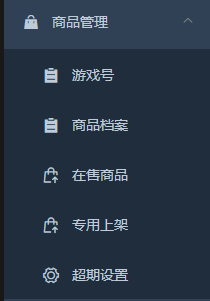
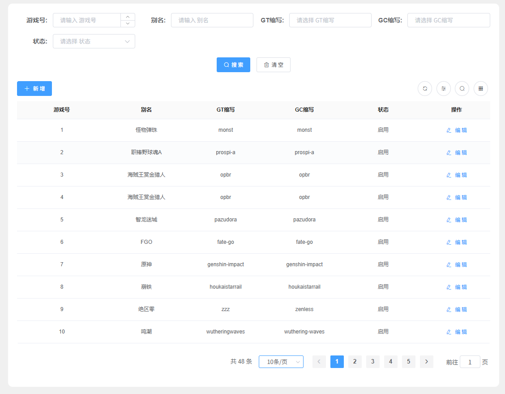
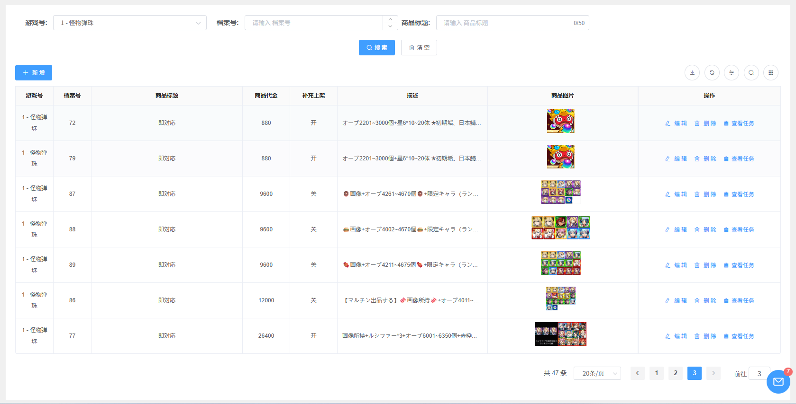
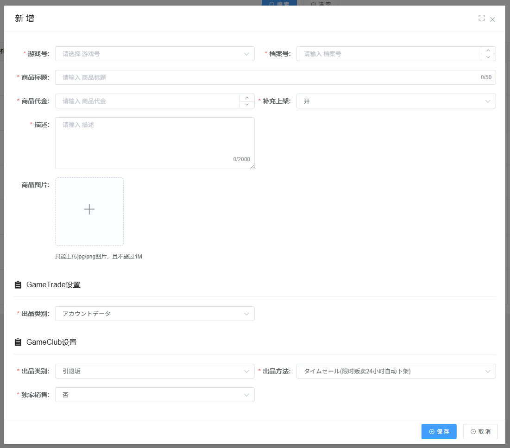
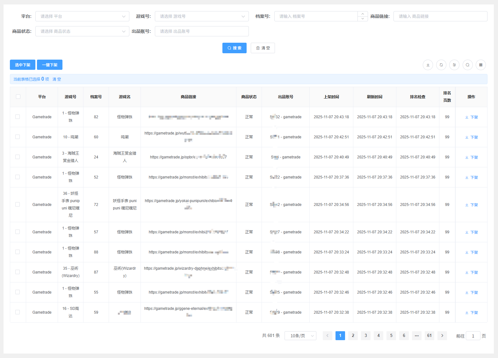
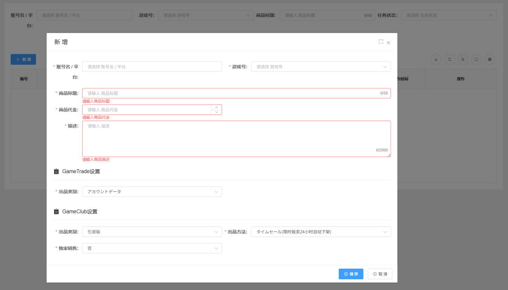
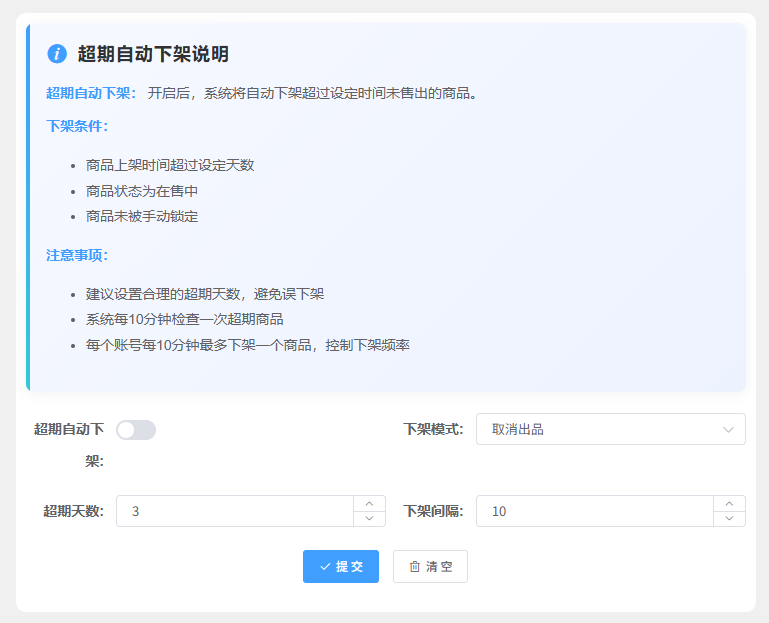

# 商品管理

## 功能简介

商品管理模块是系统的核心业务模块，负责管理游戏商品的全生命周期。从游戏号的登记管理，到商品档案的建立，再到商品的上架销售，系统提供完整的商品管理解决方案。

通过商品管理模块，您可以：

- 统一管理不同游戏的商品编号体系
- 建立和维护完整的商品档案信息
- 批量管理在售商品的上下架操作
- 处理专用商品的定制化上架需求
- 自动处理超期未售出的商品

## 功能模块

### [游戏号管理](gamecode.md)

游戏号管理是商品管理的基础模块，用于为不同的游戏建立统一的编号体系。

- **游戏号登记**：为不同的游戏创建自编号，该编号将在后续创建商品时作为必选项使用
  - 建议使用有意义的编号规则，便于后续管理和识别
  - 每个游戏号对应一个独立的游戏类型

### [商品档案管理](archives.md)

商品档案管理用于建立和维护商品的完整信息，包括基本信息、价格、描述、图片等核心数据。

- **档案建立**：为每个游戏创建不同的商品档案
- **信息维护**：维护商品的基本信息、价格、描述、图片等核心数据

#### 新增商品

创建新商品时，需要填写以下信息：

- **商品组**: 将商品添加到一个组内，方便任务编排，详情请查看[更新日志 v1.4.06](../13-appendix/changelog.md#版本 v1.4.06 (2025-11-10))
- **游戏号**：选择在游戏号管理中已创建的游戏编号
- **档案号**：该游戏号下不同商品的唯一标识
  - 可使用任务编号：1-999999
  - 建议使用连续编号，便于管理
- **商品标题**：商品的显示名称，建议简洁明了
- **商品代金**：商品的售卖价格（单位：日元）
- **补充上架**：商品卖出后，是否自动补充相同的商品上架
  - 开启后，商品售出后系统将自动创建相同商品并上架
- **商品图片**：支持上传多张商品图片
  - 建议上传清晰、高质量的商品图片
  - 多张图片将按顺序展示

#### 平台专属设置

不同平台支持专属的设置选项，可根据实际需求进行配置：

- **Gametrade 设置**：GT 平台的专属设置项
  - 根据平台要求和个人需求自行配置
  - 包括平台特定的商品属性、标签等

- **Gameclub 设置**：GC 平台的专属设置项
  - 根据平台要求和个人需求自行配置
  - 包括平台特定的商品属性、标签等

### [在售商品管理](selling.md)

在售商品管理模块用于查看和管理所有已上架的商品，支持批量操作和排名查询。

- **商品信息查看**：查看所有由系统出品的商品信息及商品链接
  - 显示商品的当前状态、价格、库存等信息
  - 可直接访问商品页面链接

- **商品下架操作**：支持多种下架方式
  - **单品下架**：对单个商品进行下架操作
  - **选中下架**：批量选择多个商品进行下架
  - **全部下架**：一键下架所有在售商品

- **商品排名查询**：查看商品在平台搜索页的排名情况
  - 显示商品当前在搜索页的页码位置
  - 帮助您了解商品的曝光情况

### [专用上架功能](dedicated.md)

专用上架功能用于处理与顾客沟通后的定制化商品上架需求，支持自定义商品信息并快速完成出品。

- **定制化上架**：与顾客沟通好商品内容后，自定义填写商品信息完成出品
  - 支持灵活的商品信息配置
  - 完成后可将商品链接直接发送给顾客

- **特殊商品管理**：管理需要特殊处理流程的商品
  - 适用于需要人工审核或特殊配置的商品

- **专属渠道配置**：为专用商品配置专属销售渠道
  - 可设置特定的销售渠道和规则

### [超期设置](archives-settings.md)

超期设置用于管理在售商品的有效期，系统将自动处理超过设定天数仍未售出的商品。

- **时间管理**：设置商品的有效期和超期时间
  - 可设置商品在售的最大天数
  - 超过设定天数后，系统将自动触发处理流程

- **自动处理**：配置超期商品的自动处理规则
  - 支持自动下架、归档等操作
  - 可根据商品类型设置不同的处理策略

- **提醒机制**：设置超期提醒和通知机制
  - 在商品即将超期时发送提醒
  - 支持多种通知方式

- **清理策略**：制定过期商品的清理和归档策略
  - 自动归档超期商品
  - 支持批量清理和恢复操作

## 使用流程

1. **创建游戏号**：在游戏号管理中为不同游戏创建编号
2. **建立商品档案**：在商品档案管理中创建商品，填写完整信息
3. **商品上架**：系统自动将商品上架到指定平台
4. **监控管理**：在在售商品管理中查看商品状态和排名
5. **自动处理**：系统根据超期设置自动处理过期商品