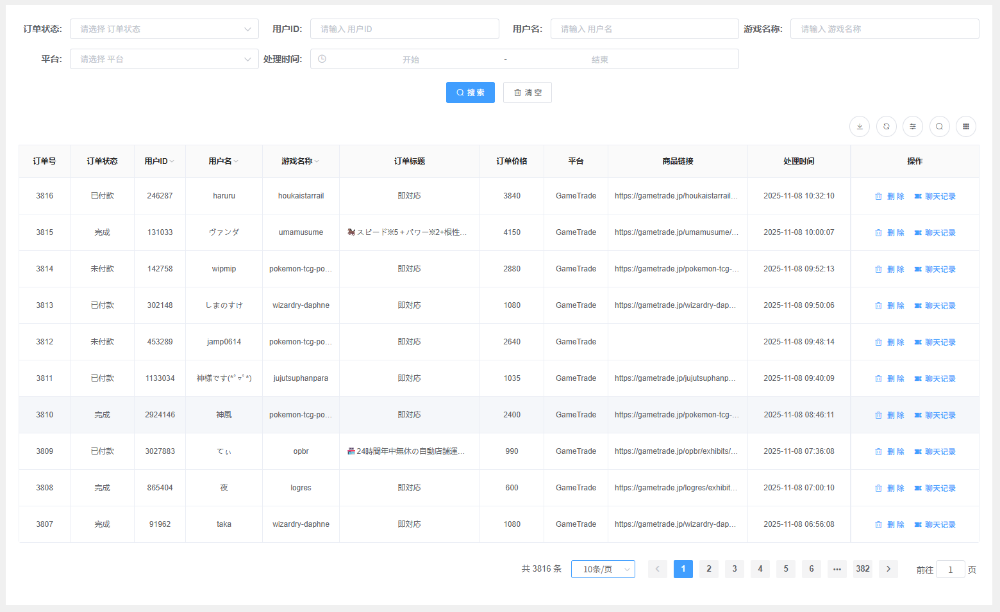

# 订单管理总览

## 功能简介

订单管理模块是系统业务流程的核心环节，负责处理从订单创建到完成交付的全过程。系统提供完整的订单生命周期管理，帮助您高效处理订单业务，降低运营风险。

通过订单管理模块，您可以：

- 快速查询和筛选订单信息
- 实时跟踪订单状态和物流信息
- 管理客户黑名单，防范交易风险
- 处理订单异常和客户纠纷
- 导出订单数据进行分析和统计

## 主要功能

### 订单查询

订单查询功能提供强大的搜索和筛选能力，帮助您快速定位和管理订单。

- **多维度查询**：支持按多种维度查询订单
  - 按时间范围查询：支持自定义时间区间
  - 按订单状态查询：待支付、已支付、已发货、已完成等
  - 按金额范围查询：筛选特定金额区间的订单
  - 按客户信息查询：根据客户名称、邮箱等查询

- **高级筛选**：提供复杂的筛选条件组合查询
  - 支持多个筛选条件同时使用
  - 可保存常用筛选条件，快速复用
  - 支持筛选条件的逻辑组合（AND/OR）

- **实时搜索**：支持订单号、客户信息等关键词实时搜索
  - 输入关键词即可实时显示匹配结果
  - 支持模糊搜索和精确匹配
  - 搜索结果高亮显示匹配关键词

- **导出功能**：支持订单数据的批量导出和报表生成
  - 支持导出为 Excel、CSV 等格式
  - 可自定义导出字段
  - 支持生成订单统计报表

### 黑名单管理

黑名单管理功能用于标记和管理风险客户，有效防范交易纠纷和经济损失。

**功能说明**：对用户进行标记，防止标记用户在其他店铺下单后产生纠纷，避免经济损失。当黑名单中的用户尝试下单时，系统将自动拦截或提醒。

- **客户黑名单**：管理恶意客户和风险客户信息
  - 添加客户到黑名单，记录风险原因
  - 支持批量导入黑名单客户
  - 可查看黑名单客户的详细信息

- **自动拦截**：根据黑名单自动拦截可疑订单
  - 黑名单客户下单时自动拦截
  - 支持设置拦截规则和提醒通知
  - 可查看拦截记录和处理历史

- **风险评估**：对客户进行风险评估和信用评级
  - 根据历史订单记录评估客户风险
  - 支持手动调整客户风险等级
  - 提供风险客户统计和分析

## 使用场景

### 日常订单处理

订单管理模块支持完整的日常订单处理流程：

- **订单确认**：处理新订单的确认和支付
  - 查看新订单详情
  - 确认订单信息和客户要求
  - 处理订单支付状态

- **发货管理**：跟踪订单的发货状态
  - 记录发货信息
  - 实时更新订单物流状态
  - 处理发货异常情况

- **售后服务**：处理订单的退换货申请
  - 处理客户的退换货请求
  - 跟踪退换货处理进度
  - 管理退款和补偿流程

- **客户服务**：处理客户咨询和投诉
  - 查看订单相关咨询
  - 处理客户投诉和纠纷
  - 维护良好的客户关系

### 风险控制

订单管理模块提供完善的风险控制机制：

- **欺诈防范**：识别和防范欺诈订单
  - 自动检测可疑订单特征
  - 识别异常支付行为
  - 防范虚假订单和刷单行为

- **信用管理**：管理客户信用风险
  - 评估客户信用等级
  - 跟踪客户交易历史
  - 建立客户信用档案

- **异常处理**：处理异常订单和纠纷
  - 快速定位异常订单
  - 处理订单纠纷和争议
  - 记录处理过程和结果

- **安全保障**：维护平台交易安全
  - 监控交易风险指标
  - 及时响应安全事件
  - 保护商家和客户权益

## 注意事项

⚠️ **重要提示**：

- **黑名单管理**：添加客户到黑名单前，请确认风险原因，避免误操作影响正常交易
- **订单查询**：建议定期导出订单数据进行备份，防止数据丢失
- **风险控制**：密切关注异常订单，及时处理可能的风险事件
- **客户服务**：保持良好的客户沟通，及时响应客户咨询和投诉