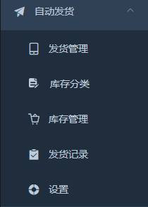
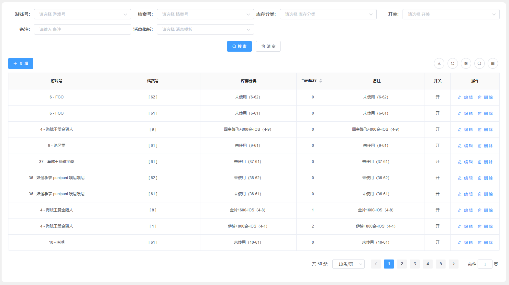
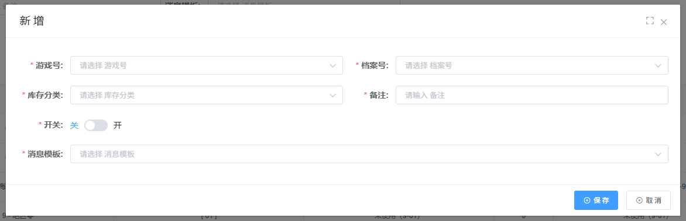
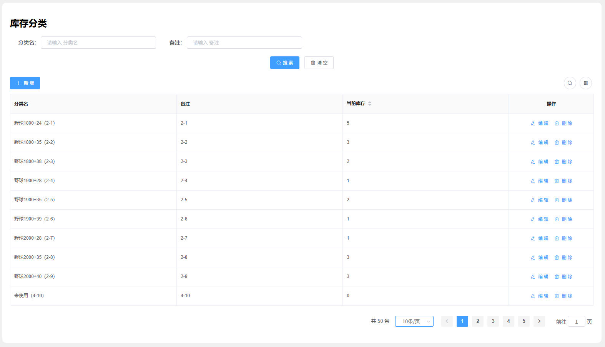
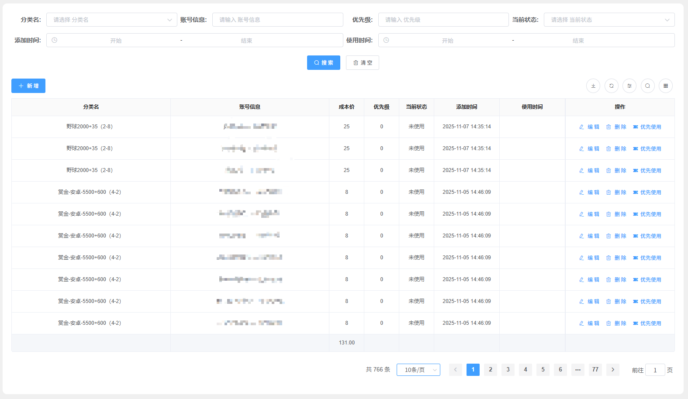
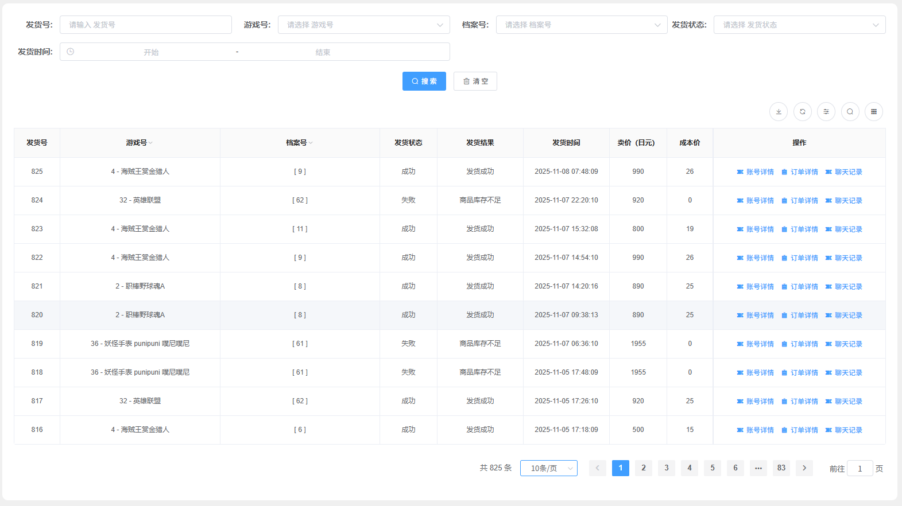
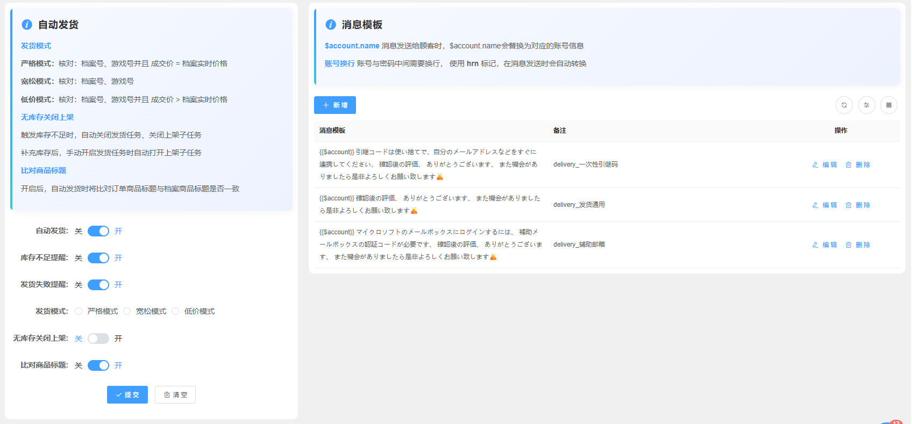
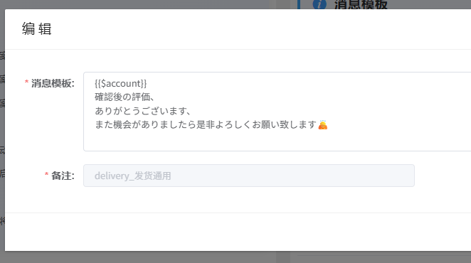

# 自动发货总览

## 功能简介

自动发货模块是系统实现业务自动化的关键组件，通过智能化的发货规则和库存管理，实现订单的自动处理和商品的高效配送。系统支持多种发货模式，满足不同业务场景的需求。

通过自动发货模块，您可以：

- 为商品配置自动发货规则和消息模板
- 管理库存分类和货物仓库
- 批量添加和管理账号信息
- 设置多种发货模式以适应不同场景
- 查看发货记录和统计数据
- 自定义发货消息模板



## 主要功能

### 发货管理




发货管理功能用于为某个商品配置自动发货规则，包括库存关联和消息模板设置。

- **游戏号**：选择需要配置发货规则的游戏
  - 从已创建的游戏号中选择

- **档案号**：选择需要配置发货规则的商品档案号
  - 支持多选，可同时为多个商品配置发货规则
  - 从已创建的商品档案中选择

- **库存分类**：选择货物库存名称
  - 支持多选，可同时关联多个库存分类
  - 当购买一个商品时，系统会同时发送多个货物
  - 适用于需要组合发货的场景

- **开关**：控制是否启用该条发货规则
  - 关闭后，该商品的自动发货将暂停
  - 可随时开启或关闭，灵活控制发货流程

- **消息模板**：自定义发货时发送给顾客的消息
  - 支持使用占位符动态插入账号信息

### 库存分类



库存分类功能用于创建不同的货物仓库名称，便于对库存进行分类管理。该页面会实时显示各分类的剩余库存数量。

- **分类管理**：按商品类型、来源、用途等维度对库存进行分类
  - 创建和管理库存分类名称
  - 支持自定义分类规则

- **分类规则**：设置自动分类规则，提高分类效率
  - 根据商品属性自动分类
  - 减少人工分类工作量

- **分类统计**：提供各分类的库存统计和分析
  - 实时显示各分类的剩余库存数量
  - 支持库存统计报表

### 库存管理



库存管理功能用于对货物仓库里的库存进行管理，可以添加、查看和编辑货物信息。

- **分类名**：选择需要添加货物的库存分类名称
  - 从已创建的库存分类中选择

- **成本价**：设置采购成本价（单位：人民币）
  - 方便后续进行数据分析和利润统计
  - 支持批量设置成本价

- **账号信息**：支持批量添加账号信息
  - 一行文本为一个账号信息
  - 支持批量导入，提高录入效率

#### 账号信息格式说明

如果账号、密码需要换行显示，请使用 **hrn** 占位符。系统在发送给顾客时，会自动将 **hrn** 转换为换行符。

**示例格式**：

```
账号: user1 hrn 密码：pass1
账号: user2 hrn 密码：pass2
账号: user3 hrn 密码：pass3
账号: user4 hrn 密码：pass4
```

### 发货记录



发货记录模块用于查看和管理所有发货记录，提供全面的发货数据统计。

- **记录查询**：查询所有发货记录的详细信息
  - 支持按时间、商品、账号等条件筛选
  - 查看每次发货的详细信息

- **状态跟踪**：跟踪发货状态信息
  - 实时显示发货状态
  - 支持状态筛选和查询

- **统计分析**：提供发货数据的统计和分析
  - 统计发货成功率和失败率
  - 分析发货趋势和规律

- **异常报告**：生成发货异常情况的报告
  - 自动记录发货异常信息
  - 提供异常详情和处理建议

### 发货设置



发货设置模块提供全局发货配置选项，包括发货开关、提醒设置和发货模式选择。

#### 基本设置

- **自动发货**：全局开关，控制所有自动发货功能
  - 关闭后，所有自动发货将暂停
  - 适用于系统维护或特殊情况

- **库存不足提醒**：商品库存不足时发送提醒
  - 当商品库存低于设定阈值时自动提醒
  - 支持多种提醒方式（邮件、短信等）

- **发货失败提醒**：异常情况导致发货失败时触发提醒
  - 自动检测发货失败情况
  - 及时通知管理员处理异常

#### 发货模式

系统提供三种发货模式，适用于不同的业务场景：

- **严格模式**：最严格的发货验证
  - 核对商品与档案号信息完全符合
  - 成交价必须等于档案实时价格
  - 适用于价格稳定的商品

- **宽松模式**：不比较价格的发货模式
  - 核对商品与档案号信息完全符合
  - 不比较成交价与档案价格
  - 适用于价格波动较大的商品

- **低价模式**：允许降价的发货模式
  - 核对商品与档案号信息完全符合
  - 成交价必须大于或等于档案实时价格
  - ⚠️ **注意**：此模式适用于商品降价但店铺存在旧价格的情况
    - 如果商品降价，会照常发货
    - 如果商品涨价，则不会发货，避免亏损

#### 消息模板设置



消息模板功能用于自定义发货时发送给顾客的消息内容。

**功能说明**：使用 `{{$account}}` 占位符表示账号信息，可以设置多条发货模板消息，系统会随机选择使用。

**模板示例**：

```
{{$account}}

引継コードは使い捨てで、自分のメールアドレスなどをすぐに連携してください、
確認後の評価、
ありがとうございます、
また機会がありましたら是非よろしくお願い致します🙇
```

**发送给顾客时的效果**：

```
账号: user1
密码：pass1

引継コードは使い捨てで、自分のメールアドレスなどをすぐに連携してください、
確認後の評価、
ありがとうございます、
また機会がありましたら是非よろしくお願い致します🙇
```

## 注意事项

⚠️ **重要提示**：

- **发货模式选择**：根据商品价格波动情况选择合适的发货模式，避免因价格不匹配导致发货失败
- **库存管理**：定期检查库存数量，及时补充库存，避免因库存不足导致发货失败
- **消息模板**：建议设置多条消息模板，增加消息的多样性，提升用户体验
- **账号信息格式**：使用 hrn 占位符时，确保格式正确，避免发送给顾客时格式错误
- **自动发货开关**：系统维护或特殊情况时，建议关闭自动发货开关，避免异常发货