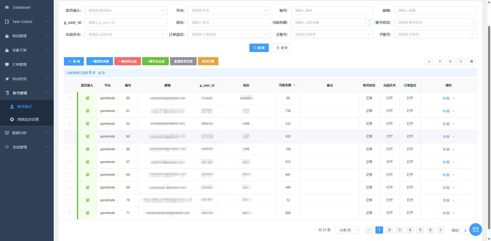
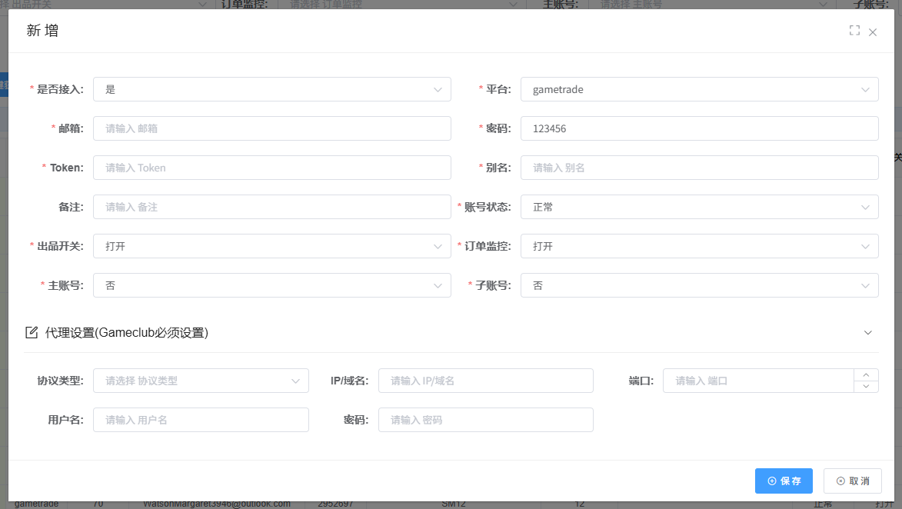

# 账号登记

🔒 **需要权限：** 账号管理权限

## 功能简介

账号登记功能允许您在系统内录入并管理各类平台账号。通过统一的管理界面，您可以便捷地配置账号信息、监控账号状态，并实现账号间的余额转移等操作。

## 页面说明

### 账号列表

账号列表页面展示了所有已登记的账号信息，包括账号状态、平台类型、别名等关键信息，方便您快速查看和管理。

## 操作功能

### 登记新账号

登记新账号时，需要填写以下信息：

- **是否接入**：选择账号是否已接入系统
- **平台选择**：选择账号所属的平台（如 gametrade.jp、gameclub.jp 等）
- **邮箱**：账号关联的邮箱地址
- **密码**：账号密码（仅作登记用途，可随意填写）
- **Token**：平台访问令牌（[查看如何获取 Token](../11-support/faq-general.md)）
- **别名**：系统内用于识别该账号的显示名称，将在其他功能模块中使用
- **账号状态**：账号当前状态，默认为"正常"
- **出品开关**：控制账号是否可以进行商品出品操作，关闭后账号将无法出品
- **订单监控**：开启后，系统将每分钟自动监控该账号的订单消息
- **主、子账号**：设置账号关系，子账号的余额将自动转移至主账号

#### 代理设置

不同平台的代理配置要求如下：

- **gametrade.jp**：系统内置代理，您也可以填写自定义代理信息
- **gameclub.jp**：必须填写代理 IP 信息，否则无法正常使用

### 删除账号

删除账号操作将永久移除该账号及其关联数据，包括：

- 该账号出品的所有商品记录
- 该账号的所有订单记录
- 其他与该账号相关的系统信息

⚠️ **警告**：删除操作不可恢复，请谨慎操作。

### 账号状态管理

账号状态用于标识账号的运行情况：

- **正常**：账号运行正常，系统将自动使用该账号执行相关操作
- **异常**：系统在运行过程中检测到账号异常时，会自动标记为异常状态，此时需要人工介入处理

建议保持账号状态为"正常"，以便系统自动管理。

## 注意事项

⚠️ **重要提示**：平台 gameclub.jp 必须填写代理 IP 信息，否则账号将无法正常使用。

## 常见问题

- **Token**：[查看如何获取 Token](../11-support/faq-general.md)

---

*相关文档：*
- [消息监控设置](message-monitor.md)
