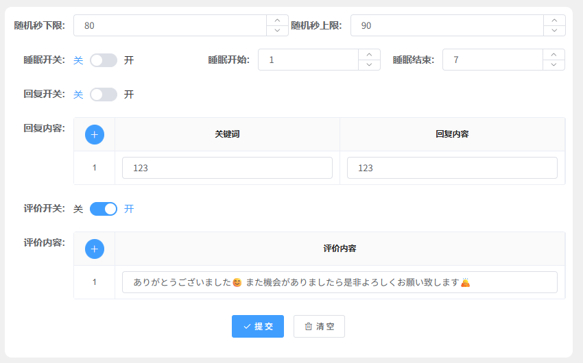

# 消息监控设置

🔒 **需要权限：** 账号管理权限

## 功能简介

消息监控功能用于自动监控和管理平台订单消息，支持自定义监控间隔、睡眠时段、自动回复商品评论以及自动评价订单。通过合理配置这些设置，可以有效提升账号管理效率，减少人工操作负担。

## 设置项说明

### 时间设置

时间设置用于控制订单监控的检测间隔，系统会在设定的时间范围内随机选择检测间隔，避免固定频率被平台识别。

- **随机秒下限**：订单监控间隔的最小时间（单位：秒）
  - 建议值：600 秒（10 分钟）
  - 系统将在下限和上限之间随机选择检测间隔

- **随机秒上限**：订单监控间隔的最大时间（单位：秒）
  - 建议值：900 秒（15 分钟）
  - 确保上限值大于下限值

### 睡眠设置

睡眠设置允许您在指定时间段内暂停订单消息检测，适用于非营业时间或需要维护的时段。

- **睡眠开关**：开启后，系统将在指定时间段内暂停检测新订单消息
  - 关闭时，系统将全天候监控订单消息

- **睡眠开始**：睡眠时段的开始时间
  - 取值范围：0-23（24 小时制）
  - 例如：22 表示晚上 10 点开始睡眠

- **睡眠结束**：睡眠时段的结束时间
  - 取值范围：1-24（24 小时制）
  - 例如：8 表示早上 8 点结束睡眠
  - 注意：结束时间必须大于开始时间

### 自动回复设置

自动回复功能针对商品评论生效，当买家在商品页面留下评论时，系统可根据预设规则自动回复。

- **回复开关**：是否启用自动回复功能
  - 开启后，系统将根据配置的回复规则自动处理商品评论

- **回复内容**：自定义回复规则配置
  - 支持设置多组关键词与对应回复内容
  - 当评论中包含匹配的关键词时，系统将自动发送对应的回复内容
  - 可配置多条规则，系统按优先级匹配

### 自动评价设置

自动评价功能在订单顾客确认收货后自动执行，帮助您快速完成订单评价流程。

- **评价开关**：是否启用自动评价功能
  - 开启后，当订单状态为"顾客确认收货"时，系统将自动发送评价

- **评价内容**：配置系统自动评价的内容模板
  - 支持自定义评价文本
  - 可设置多个评价模板，系统随机选择使用
  - 建议使用积极正面的评价内容

## 配置步骤

1. 进入消息监控设置页面
2. 根据实际需求配置时间设置（建议使用默认值 600-900 秒），如果配置了自动发货，推荐设置为：90 - 120秒
3. 如需在特定时段暂停监控，开启睡眠开关并设置时间段
4. 如需自动回复商品评论，开启回复开关并配置关键词规则
5. 如需自动评价订单，开启评价开关并设置评价内容模板
6. 保存配置后，系统将按照设定规则自动运行

## 注意事项

⚠️ **重要提示**：

- 时间设置中的随机秒上限必须大于随机秒下限，否则配置无效
- 睡眠设置的结束时间必须大于开始时间，跨天时段需要特殊处理
- 自动回复规则建议定期检查和更新，确保回复内容符合平台规范
- 自动评价内容应避免使用相同模板，建议设置多个模板以增加真实性
- 建议在非营业时间开启睡眠设置，以减少不必要的系统资源消耗