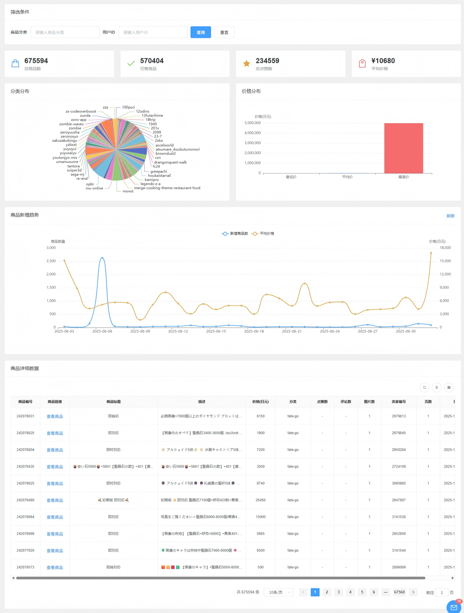
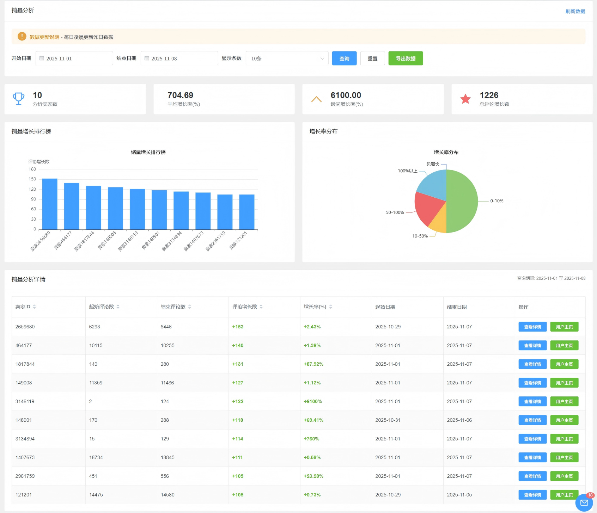
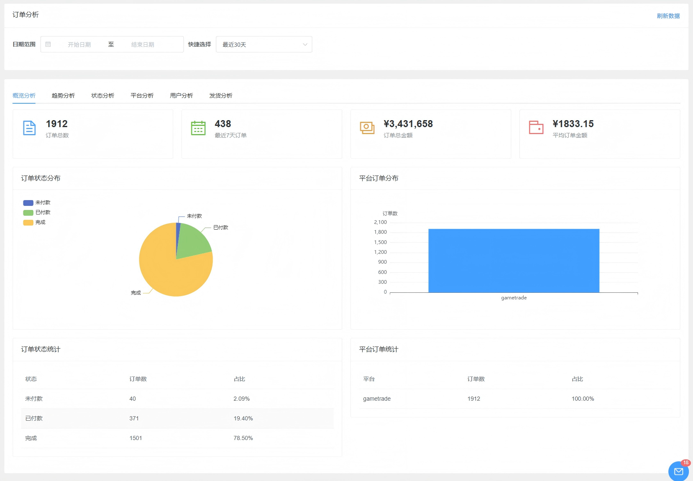

# 数据分析总览

🔒 **需要权限：** 管理员权限

## 功能简介

数据分析模块提供多维度的数据分析和统计功能，帮助您深入了解业务运营情况，做出更明智的决策。系统支持从商品、销售、店铺等多个维度进行分析，功能持续更新和完善。

通过数据分析模块，您可以：

- 分析 GT 全站商品信息，了解市场行情
- 基于评价数量变化分析店铺销售情况
- 分析自身店铺的销售趋势和畅销商品
- 查看订单完成情况和店铺运营状态
- 辅助选品和运营策略制定

## 主要功能

### 商品分析

商品分析功能用于分析 GT 全站商品的全部信息，帮助您了解市场行情和商品分布情况。

- **全站商品分析**：分析 GT 平台全站商品信息
  - 获取商品价格、销量、评价等关键数据
  - 了解市场整体情况和趋势

- **游戏分类筛选**：按游戏分类进行商品查询和分析
  - 可设置游戏分类，筛选特定游戏类型的商品
  - 便于分析特定游戏市场的商品情况

- **店铺ID查询**：指定卖家店铺ID进行商品查询
  - 可输入特定店铺ID，查看该店铺的商品信息
  - 便于分析竞争对手的商品策略

- **数据导出**：支持将分析结果导出，便于进一步分析

### 全网店铺分析

全网店铺分析功能基于店铺的评价数量变化，分析店铺的销售情况，为选品和运营决策提供数据支持。

- **销售情况分析**：基于店铺评价数量变化分析销售情况
  - 通过评价数量变化趋势判断店铺销售活跃度
  - 识别销售增长或下降的店铺

- **商品信息查看**：支持跳转查看店铺售卖的商品信息
  - 点击店铺可查看该店铺的所有商品
  - 了解店铺的商品结构和定价策略

- **店铺分析**：综合分析店铺运营情况
  - 分析店铺的商品种类、价格区间、销量分布
  - 识别优质店铺和潜力店铺

- **选品辅助**：辅助选品操作
  - 通过分析热销店铺和商品，发现选品机会
  - 了解市场趋势，指导选品决策

### 订单分析、销售分析

订单分析和销售分析功能用于分析自身所有店铺的销售情况，提供全面的运营数据支持。

- **销售情况分析**：分析所有店铺的整体销售情况
  - 查看销售额、订单量等关键指标
  - 了解各店铺的销售表现

- **销售趋势分析**：分析销售趋势和变化规律
  - 查看销售额和订单量的时间趋势
  - 识别销售高峰期和低谷期
  - 预测未来销售趋势

- **畅销商品分析**：识别和分析畅销商品
  - 统计各商品的销售量和销售额
  - 识别热销商品和滞销商品
  - 为商品管理提供数据支持

- **订单完成情况**：分析订单完成情况
  - 统计订单完成率、退款率等指标
  - 识别订单处理中的问题
  - 优化订单处理流程

- **未开张店铺分析**：分析未开张或低活跃度的店铺
  - 识别长期未开张的店铺
  - 分析店铺不活跃的原因
  - 制定店铺激活策略

## 使用场景

### 市场调研

- 通过商品分析了解市场行情和竞争情况
- 分析热销商品和价格趋势，指导定价策略
- 识别市场机会和潜在风险

### 选品决策

- 通过销量分析发现热销店铺和商品
- 分析商品销售趋势，选择有潜力的商品
- 了解市场需求，优化商品结构

### 运营优化

- 通过订单分析了解销售表现和趋势
- 识别畅销商品，加大推广力度
- 分析未开张店铺，制定激活策略

### 决策支持

- 基于数据分析结果制定运营策略
- 优化商品定价和库存管理
- 提升整体业务运营效率

## 注意事项

⚠️ **重要提示**：

- **数据更新**：数据分析结果基于实时数据，建议定期查看以获取最新信息
- **数据准确性**：分析结果仅供参考，实际决策时需结合其他因素综合考虑
- **功能更新**：数据分析功能持续更新，新功能将逐步添加