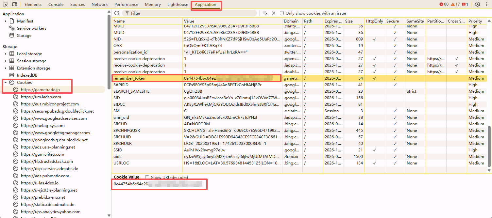

# 常见问题FAQ

## 登录与账号

### Q：怎么获取账号的Token？
A：请按照以下步骤操作：
1. 使用Chrome、Edge 系统平台
2. 按F12 打开开发者面板
3. 切换到"Application"、"Cookies"、"https://gametrade.jp 或者 https://gameclub.jp"
4. 查找对应平台的token名称
- gametrade名称为：remember_token
- gameclub名称为: PHPSESSION
5. 复制Token到账号登记中

## 数据相关

### Q: 数据更新时间？
**A:** 各类数据的更新时间：
- **订单数据**：实时更新，延迟不超过1分钟
- **库存数据**：实时更新，延迟不超过30秒
- **统计数据**：每小时更新一次
- **报表数据**：每天凌晨2点更新前一天数据

## 技术问题

### Q: 移动端能否使用？
**A:** 移动端使用说明：
- **响应式设计**：系统支持移动端访问
- **功能限制**：部分复杂功能在移动端可能受限
- **推荐设备**：建议使用平板电脑获得更好体验
- **浏览器要求**：移动端浏览器需要支持JavaScript

---

*相关文档：*
- [故障排查指南](troubleshooting.md)
- [任务相关问题](faq-task.md)
